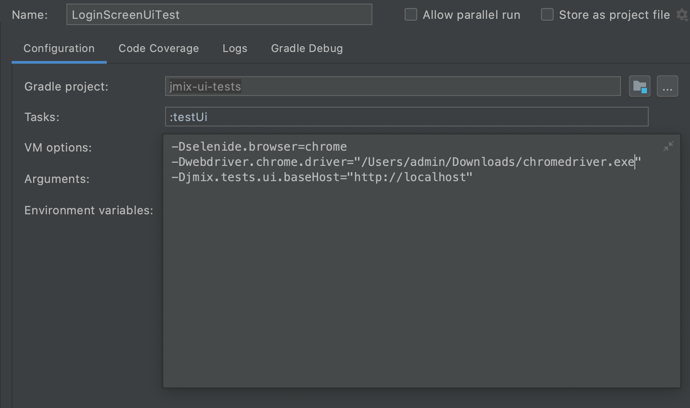
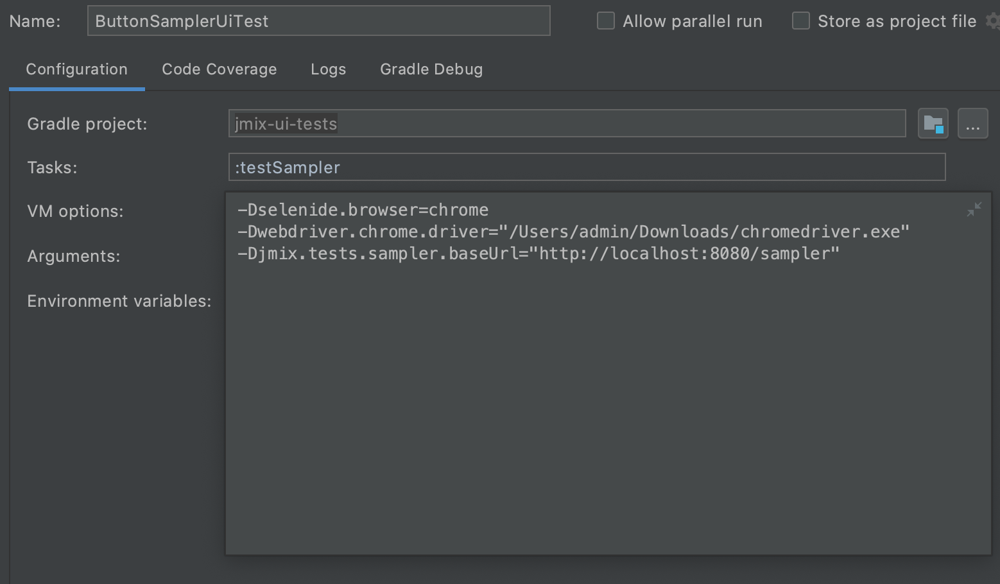
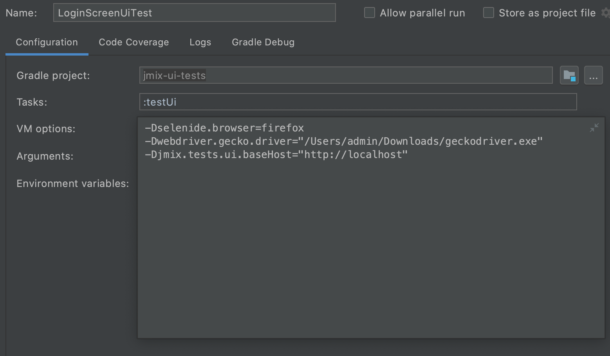
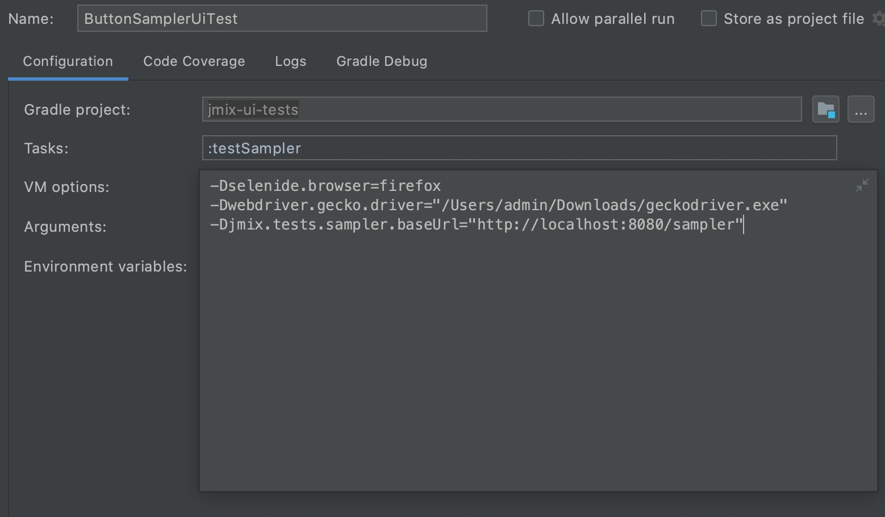

# jmix-ui-tests

Jmix UI test suite

## Dependencies

1. JUnit 5 (https://junit.org/junit5/)
2. Selenide (https://ru.selenide.org/)
3. Testcontainers (https://www.testcontainers.org/)
4. SpringBoot (https://spring.io/projects/spring-boot)
5. Liquibase (https://www.liquibase.org/)
5. Jmix Masquerade

## Description

There are two packages in `jmix-ui-tests`:
1. `ui`- contains UI tests for testing Jmix projects
2. `sampler`- contains UI tests for testing [Jmix Sampler project](https://github.com/Haulmont/jmix-sampler)

#### Configuring
* Use ```jmix.tests.ui.baseUrl``` property to define the base url for selenide browsers in ui package; 
* Use ```jmix.tests.sampler.baseUrl``` property to define the base url for selenide browsers in sampler package; 

### SpringBoot tests

All tests in UI package are based on Spring Boot tests. This means that you do not need to separately launch the main 
application. The application instance is launched along with the tests. The test application instance runs on a random port, 
using `SpringBootTest.WebEnvironment.RANDOM_PORT` the setting. This way you can run multiple tests at the same time, as 
well as run tests while the main application is running.

In order to have JUnit 5 library support, you need to add the [SpringBootExtension](./src/test/groovy/io/jmix/tests/ui/extension/SpringBootExtension.groovy) 
in your tests.

Tests in sampler package are not based on Spring Boot tests. Therefore, they need to be launched only when the Jmix 
Sampler application is already running.

### Selenide browser containers

Test browser containers are used to instantiate web browsers. Creation of browser containers is fast, so it's actually 
quite feasible to have a totally fresh browser instance for every test.
There are two browser containers in `jmix-ui-tests`:
1. [ChromeExtension](./src/test/groovy/io/jmix/tests/base/extension/ChromeExtension.groovy) - a junit5 extension that 
creates a test container with Chrome browser for each test:
   ```groovy
   @ExtendWith(ChromeExtension)
   class UiTest {
       @Test
       void test() {
          ...
       }
   }
   ```
2. [FirefoxExtension](./src/test/groovy/io/jmix/tests/base/extension/FirefoxExtension.groovy) - a junit5 extension that 
creates a test container with Firefox browser for each test:
   ```groovy
   @ExtendWith(FirefoxExtension)
   class UiTest {
       @Test
       void test() {
          ...
       }
   }
   ```

#### Debugging

Each test browser container contains VNC recorder for debugging tests. You can find the following line in the logs when 
starting the test:
```
INFO 5504 --- [Test worker] i.j.t.extension.BrowserExtension : VNC recorder url: vnc://localhost:32903, password='secret'
```
Then open the page from the URL in your browser and enter the password provided.

#### Locally installed browser drivers

Please note that you need to download one of the latest versions of the web driver 
depending on the browser you want to use to testing. For Chrome browser this is 
[chromedriver](http://chromedriver.chromium.org/downloads), for Firefox this is 
[geckodriver](https://github.com/mozilla/geckodriver/releases). Also, you  need to 
remove the use of `@ExtendWith(ChromeExtension)` annotation for test class.

#### Locally installed Chrome browser driver

If you run your tests in Chrome browser, you need to edit standard
test configuration for the test project in IntelliJ. To do so, click the 
*Select Run/Debug Configuration* button and select *Edit Configurations*  in the 
drop-down list. In the VM options field, add the following:

* UI package
```
-Dselenide.browser=chrome 
-Dwebdriver.chrome.driver=<your_path>/chromedriver.exe 
-Djmix.tests.ui.baseHost=http://localhost
```


* Sampler package
```
-Dselenide.browser=chrome 
-Dwebdriver.chrome.driver=<your_path>/chromedriver.exe 
-Djmix.tests.sampler.baseUrl=http://localhost:8080/sampler
```


where `<your_path>` is the path to the chrome driver on your computer.

After that select the simple test or the test class you want to run, right 
click on it and select *Debug* option.

To run the tests using Gradle, run the following task in the terminal:
* UI package
```
gradle testUi -Dselenide.browser=chrome -Dwebdriver.chrome.driver=<your_path>/chromedriver.exe -Djmix.tests.ui.baseHost=http://localhost
```

* Sampler package
```
gradle testSampler -Dselenide.browser=chrome -Dwebdriver.chrome.driver=<your_path>/chromedriver.exe -Djmix.tests.sampler.baseUrl=http://localhost:8080/sampler
```
    
where `<your_path>` is the path to the chrome driver on your computer.

#### Locally installed Firefox browser driver

If you run your tests in Firefox browser, you need to edit standard
test configuration for the test project in IntelliJ. To do so, click the 
*Select Run/Debug Configuration* button and select *Edit Configurations*  in the 
drop-down list. In the VM options field, add the following:

* UI package
```
-Dselenide.browser=firefox
-Dwebdriver.gecko.driver=<your_path>/geckodriver.exe 
-Djmix.tests.ui.baseHost=http://localhost
```


* Sampler package
```
-Dselenide.browser=firefox 
-Dwebdriver.gecko.driver=<your_path>/geckodriver.exe 
-Djmix.tests.sampler.baseUrl=http://localhost:8080/sampler
```


where `<your_path>` is the path to the firefox driver on your computer.

After that select the simple test or the test class you want to run, right 
click on it and select *Debug* option.

To run the tests using Gradle, run the following task in the terminal:
* UI package
```
gradle testUi -Dselenide.browser=firefox -Dwebdriver.gecko.driver=<your_path>/geckodriver.exe -Djmix.tests.ui.baseHost=http://localhost
```

* Sampler package
```
gradle testSampler -Dselenide.browser=firefox -Dwebdriver.gecko.driver=<your_path>/geckodriver.exe -Djmix.tests.sampler.baseUrl=http://localhost:8080/sampler
```
    
where `<your_path>` is the path to the firefox driver on your computer.

### Database containers
The database containers are used from the `Testcontainers` library. For example, in order to add a container with a 
`postgreSql` database, you need to add two dependencies:
* `testRuntime 'org.postgresql:postgresql:42.2.16'` - a PostgreSql database implmentation;
* `testImplementation 'org.testcontainers:postgresql:1.14.3'` - a test container implementation.

A fresh database is created for each test. In order to determine what data should be initialized in the database, 
liquibase contexts are used. The context for main application is **"base"**, it must always be added to the list of 
contexts for the application to work correctly.

To create UI test that uses a test dataset in addition to the base dataset, you need to follow these steps:
1. Create a database Spring Initializer to define datasource properties:
```
class PostgreSQLContextInitializer implements ApplicationContextInitializer<ConfigurableApplicationContext> {

    static PostgreSQLContainer postgreSQL = new PostgreSQLContainer()
            .withDatabaseName("postgres-test-db")
            .withUsername("test")
            .withPassword("pass")

    @Override
    void initialize(ConfigurableApplicationContext applicationContext) {
        postgreSQL.start()
        TestPropertyValues.of(
                "main.datasource.jdbcUrl=" + postgreSQL.getJdbcUrl(),
                "main.datasource.username=" + postgreSQL.getUsername(),
                "main.datasource.password=" + postgreSQL.getPassword(),
                "jmix.data.dbmsType=postgres"
        ).applyTo(applicationContext.getEnvironment())
    }
}
```
2. Create a [changeSet](./src/main/resources/io/jmix/tests/liquibase/changelog/test/2020/08/31-010-init-selenium-role.xml) 
and define a context for it:
```
    <changeSet id="4" author="jmix-ui-tests" context="test-role">

        <insert tableName="SEC_ROLE_ENTITY">
            <column name="ID" value="cc9e420a-2b7a-4c42-8654-a9027ee14083"/>
            <column name="VERSION" value="1"/>
            <column name="NAME" value="test-selenium"/>
            <column name="CODE" value="test-selenium"/>
        </insert>

    </changeSet>
```
In the above example, we have created a change set with the `test-role` context.
3. Create a Spring Boot test, define `jmix.liquibase.contexts` property inside `@SpringBootTest` annotation and define 
the initializer class inside `@ContextConfiguration` annotation:
```
@ExtendWith([
        SpringBootExtension
])
@SpringBootTest(classes = JmixUiTestsApplication,
        webEnvironment = SpringBootTest.WebEnvironment.RANDOM_PORT,
        properties = ['jmix.liquibase.contexts=base,test-role'])
@ContextConfiguration(initializers = PostgreSQLContextInitializer)
class UserUiTest extends BaseUiTest {

    @Test
    void test() {
        ...
    }
}
```
As a result, your tests will have data from two contexts: `base` and `test-role`.

## Run tests

* Tests in UI package - ```gradle testUI```
* Tests in Sampler package - ```gradle testSampler```
* All tests ```gradle test```

## Sample test in UI package

```
@ExtendWith([
        SpringBootExtension,
        ChromeExtension
])
@SpringBootTest(classes = JmixUiTestsApplication,
        webEnvironment = SpringBootTest.WebEnvironment.RANDOM_PORT,
        properties = ['jmix.liquibase.contexts=base,test-role'])
@ContextConfiguration(initializers = PostgreSQLContextInitializer)
class UserUiTest extends BaseUiTest {

    @Test
    @DisplayName("Creates new user")
    void createNewUser() {
        loginAsAdmin()

        $j(MainScreen).with {
            sideMenu.openItem(USER_BROWSE)
                    .createUser()
        }

        $j(UserEditor).with {
            usernameField.setValue('newUsername')
            passwordField.setValue('qO4Hn6o')
            confirmPasswordField.setValue('qO4Hn6o')

            addBtn.click()

            $j(RoleModelLookup).with {
                roleModelsTable.getCell(withText('test-selenium'))
                        .click()
                lookupSelectAction.click()
            }

            windowCommitAndClose.click()
        }

        $j(UserBrowse).usersTable
                .getCell(withText('newUsername'))
                .shouldBe(visible)
    }
}
```
## Sample test in Sampler package
```groovy
@ExtendWith(ChromeExtension)
class ButtonSamplerUiTest extends BaseSamplerUiTest {

    @Test
    @DisplayName("Checks that user can click on simple button")
    void clickOnSimpleButton() {
        openSample('button-simple')

        $j(Button.class, 'helloButton')
                .shouldHave(caption('Say Hello!'))
                .click()

        $j(Notification.class)
                .shouldHave(caption('Hello, world!'))
    }
}
```